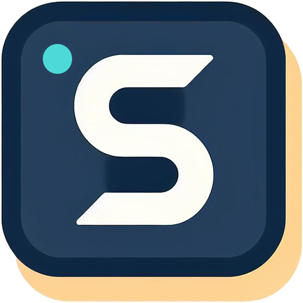
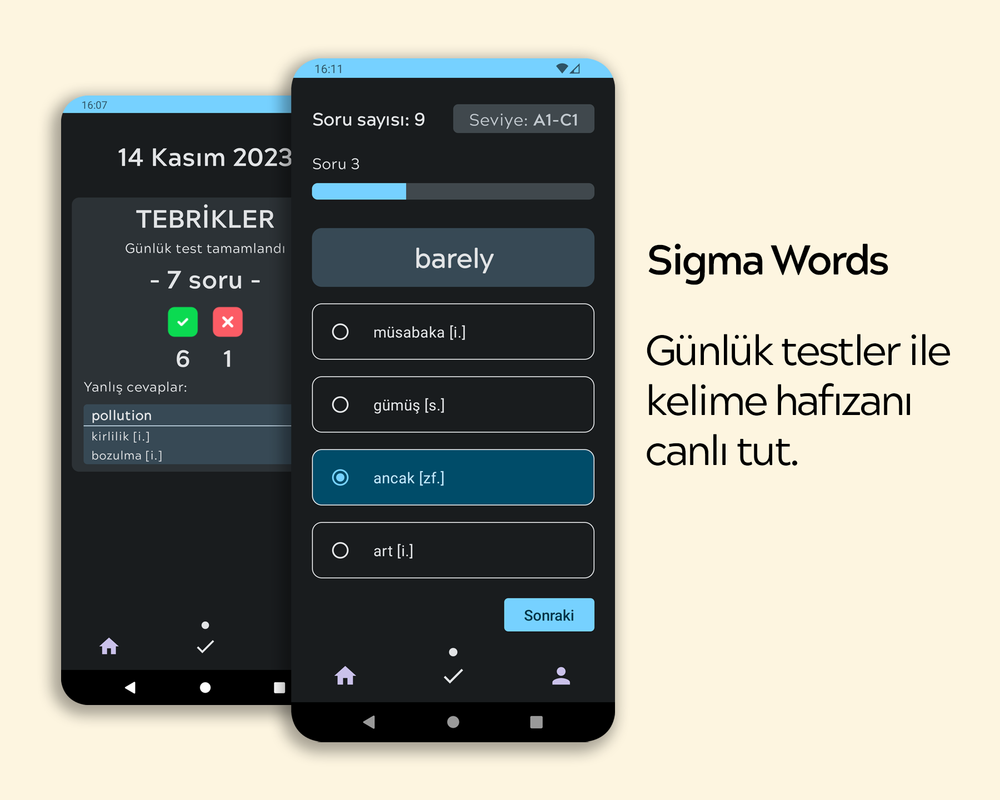
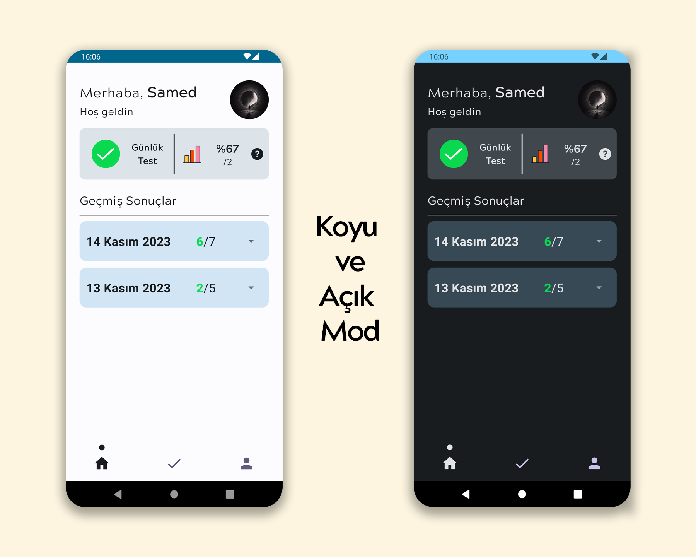
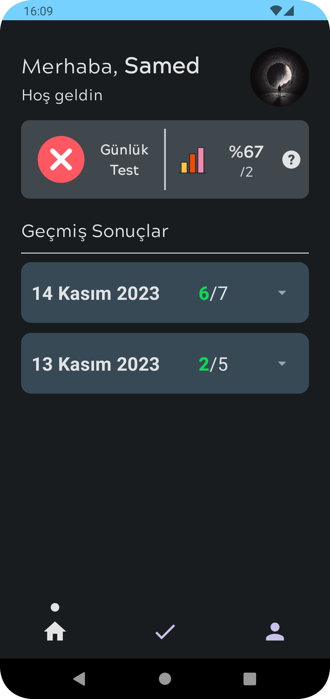
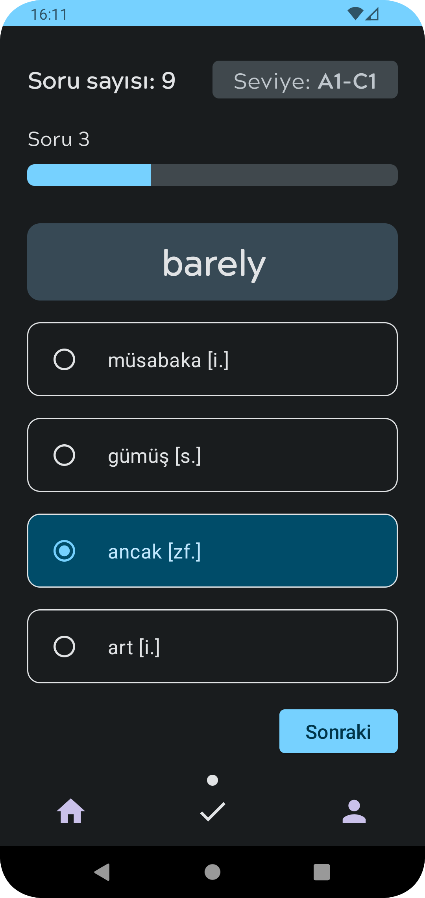
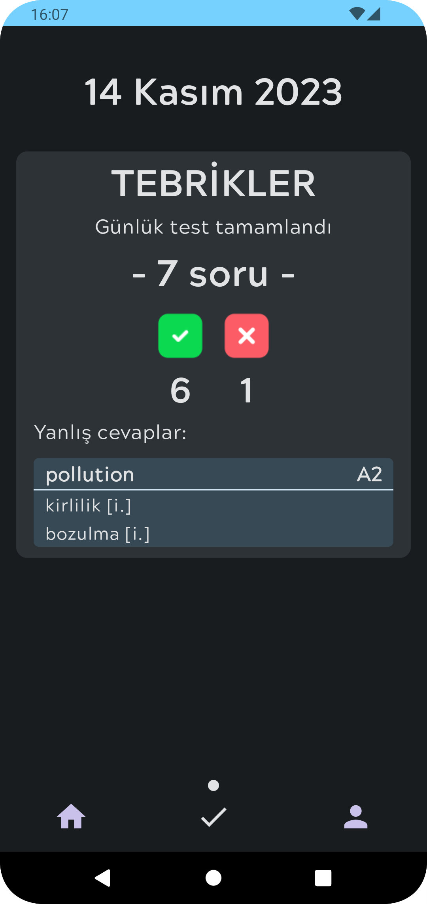
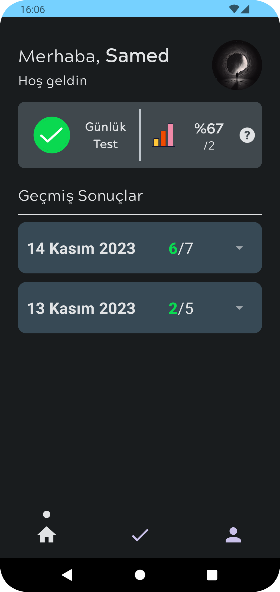
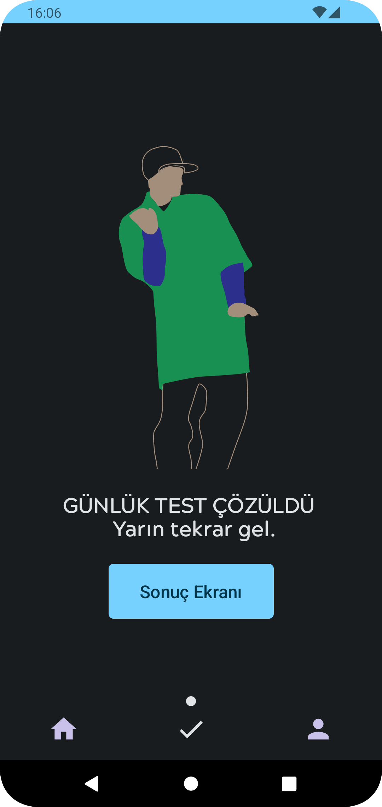
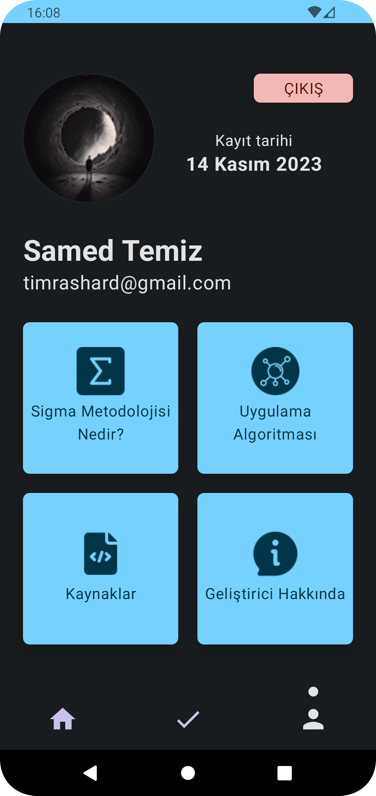

# Sigma Words

| Screenshots | Screenshots |
|:--------------:|:---------------:|
|||
|||
|||
|||

- Sigma Words is a mobile application focused on word learning. The basic algorithm of the application is that users try to answer a word correctly in 6 different time periods. A new test every day and questions waiting to be answered!

## Technologies I use
- Clean Architecture (MVVM)
- Dependency Injection - Hilt
- Datastore Preferences
- Coroutines
- LiveData
- Firebase: FireStore/Authentication
- Room Database
- Retrofit
- Jetpack Compose
- Navigation
- Lottie/Glide/Markdown

